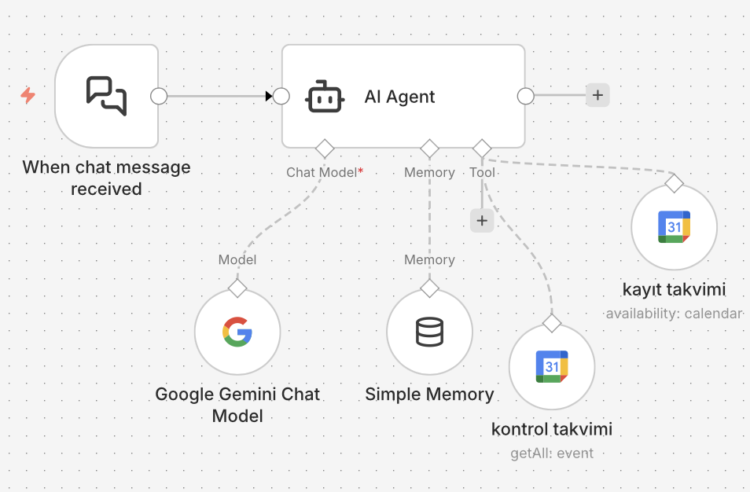

# n8n-asm-appointment-agent
# 🏥 Smart Nurse: AI-Powered ASM Appointment System

This project is an automated healthcare appointment system built with **n8n**, **Google Gemini AI**, and **Google Calendar**, designed specifically for Family Health Centers (ASM).

---

## 📸 Workflow Preview

*(Note: Ensure the image file name matches the one you uploaded)*

---

## 👩‍⚕️ AI Persona & Logic (English)
The core of this project is an AI Agent with a **disciplined and authoritative Head Nurse** persona.

- **Discipline:** She does not tolerate health neglect. She is firm and strict about follow-ups, but only for the patient's well-being.
- **Goal:** Listens to patient symptoms, determines the need for vaccination or examination, checks the calendar for availability, and records the appointment.
- **Tone:** Professional, clean, yet "tough love" style.

### 🛠 Technical Stack
- **n8n:** Workflow automation platform.
- **Google Gemini (LLM):** The "brain" of the agent.
- **Google Calendar Tools:** One node for availability checks (control) and one for booking (registration).
- **Simple Memory:** Maintains context throughout the conversation.

---

## 🏥 Akıllı Hemşire: Yapay Zeka Destekli ASM Randevu Sistemi (Türkçe)

Bu proje, Aile Sağlığı Merkezleri (ASM) için n8n üzerinde geliştirilmiş; Google Gemini AI ve Google Calendar ile entegre çalışan bir randevu otomasyonu taslağıdır.

### 👩‍⚕️ Yapay Zeka Personası ve Mantığı
Projenin merkezinde, disiplinli ve otoriter bir **Başhemşire** karakterine sahip bir AI Agent yer alır.

- **Disiplin:** Hastaların sağlıklarını ihmal etmesine izin vermez. Tavrı serttir ama bu tamamen hastanın iyiliği içindir.
- **Görev:** Hastanın şikayetini dinler, aşı veya muayene ihtiyacını analiz eder, takvimdeki boş saatleri kontrol eder ve randevuyu oluşturur.
- **Üslup:** Temiz ve profesyonel bir dil kullanır ancak ihmalkar hastalara karşı tavizsizdir.

### 🚀 Kurulum Adımları
1. **İçe Aktar:** Buradaki `.json` dosyasını indirin ve n8n panelinize "Import" edin.
2. **Yetkilendirme:** Google Gemini API anahtarınızı ve Google Calendar OAuth2 bilgilerinizi tanımlayın.
3. **Test Et:** Chat tetikleyicisi üzerinden hemşire ile konuşmaya başlayın!

---
*Created with ❤️ for healthcare automation.*
